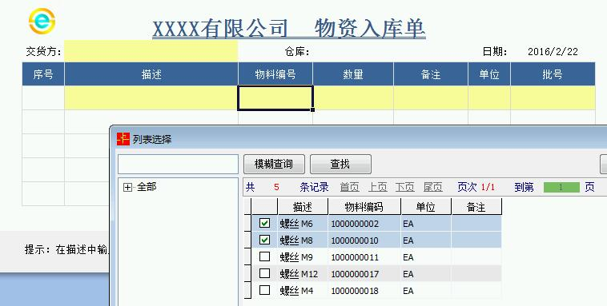

# 1.10 实现ES列表选择不重复
需求：通过ES列表选取内容后，下次再选择时过滤掉已选择的项目。

示例如下，第一次选择了“M6、M8螺丝”，下次不再显示

* 第一次选择  
 
 
* 第二次选择  

 
### 实现原理   
* 使用UD表技术，即定义一个明细U表叠放在明细D表上，并且不创建数据库。

!> 当然，你也可以不叠加，在侧面定义明细表，然后用EXCEL公式联系起来，不过显然这并不高明。

* 使用 **“不属于”** 结合 **“此集合”** 实现过滤。 
 
 

<a href="../files/1.10.rar" download>示例ES模板下载（导入时勾选"同时导入数据"）</a>

### 延伸阅读
示例为9.4.124下的方案，事实上，经过村长提需求后，高级版已经有新设置项，筛选条件可勾选行匹配，也就是说不再需要定义辅助明细表了。
