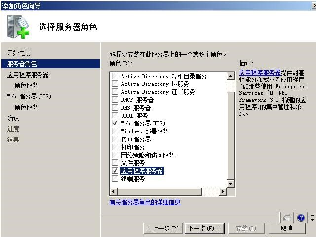
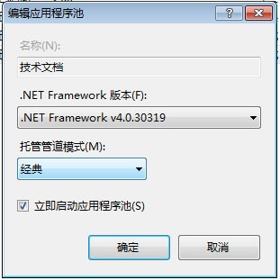
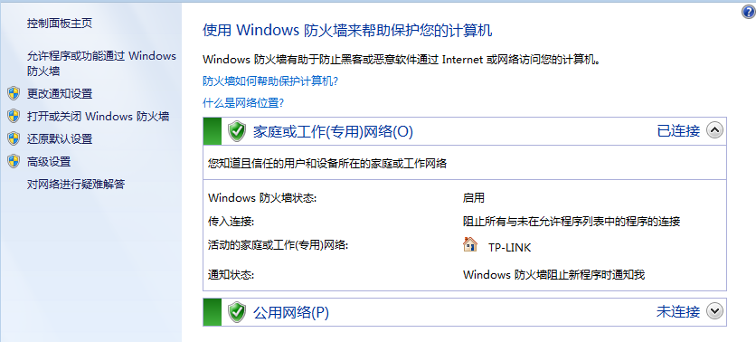
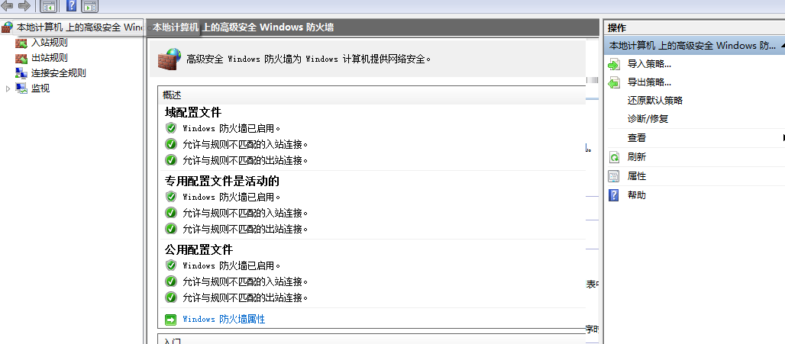
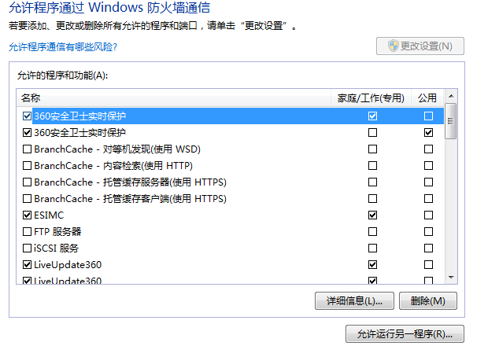
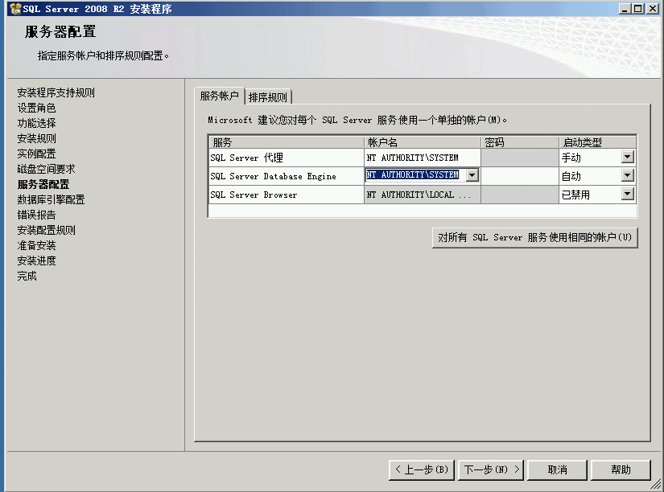

# 1.2 EXCEL服务器-非常新新手入门

## 一、下载安装
从网上下载勤哲EXCEL服务器安装软件，按相关提示进行安装。

## 二、非常新新手入门
强烈建议先学习官方教程，视频或文档（基本操作、上手指南都在里面，耐心看1，2天可解决很多问题）

## 三、常见问题
#### 问题：无法运行或闪退  
解决：请查看EXCEL是启用 “宏或ACTIVEX”功能  

#### 问题：EXCEL服务器登陆窗口秒退或者打开EXCEL未发现EXCEL服务器的加载项  
解决：在EXCEL查看EXCEL服务器的加载项(dll,xla)是否被禁用

#### 问题：无法登陆到EXCEL，提示错误“1972222”  
解决：自定义PATH路径,将ES安装目录手工加入

#### 关于网页填报
因为是WIN7*64位+EXCEL2007，默认的是MS 桌面SQL，所以遇到了一堆问题，仅供参考  
  * 安装IIS,在“控制面板-程序和功能-打开或关闭windows功能-服务器管理器-添加角色”，选择安装“Web服务器（IIS）”和“应用程序服务器”  

  * 选择 ASP.net和IIS6 管理兼容性  
 

  * 双击ASP，启动父路径  
  

  * 应用程序运行 32位应用程序  
  

#### 网页提示：`HTTP 错误 500.23 - Internal Server Error 检测到在集成的托管管道模式下不适用的 ASP.NET 设置`。

**为什么会出现以上错误？**
 * 在IIS7的应用程序池有两种模式，一种是“集成模式”，一种是“经典模式”。
 * 经典模式 则是我们以前习惯的IIS 6 的方式。
 * 如果使用集成模式，那么对自定义的httpModules 和 httpHandlers 就要修改配置文件，需要将他们转移到`<modules>`和`<hanlders>`节里去。
 * 解决方法：`配置应用程序池`

在IIS7上配置应用程序池，并且将程序池的模式改为“经典”，之后一切正常。如图：  
 

## 四、局域网其他电脑连接设置
 * 服务器电脑防火墙设置  

 * 高级设置  

 * 允许程序通过防火墙通信  
 * 选中WEB管理服务  
 * 选中万维网（HTTP）  

## 五、新手安装SQLSERVER注意事项
数据库目前推荐使用SQL 2008 R2，安装过程中需要注意以下几个配置（请不要无谓的全勾，生产环境根本用不到！）：

  
*(注意：如果数据库是SQL2008以上，安装时不要勾选安装“示例库”。如果要解决此问题参考以下图片)*  

>@木头  

**SQL2008安装后激活方式以及提示评估期已过解决方法**

* 第一步：进入SQL2008配置工具中的安装中心  
* 第二步：再进入维护界面，选择版本升级  
* 第三步：进入产品密钥，输入密钥  
* 第四步：一直点下一步，直到升级完毕。  
SQL Server 2008 Developer：PTTFM-X467G-P7RH2-3Q6CG-4DMYB  
SQL Server 2008 Enterprise：JD8Y6-HQG69-P9H84-XDTPG-34MBB  
如以上操作还是连接不进服务器，修改系统时间（把时间提前），即可登录  
 
**如果问题依然没有解决还是显示评估期已过(据说这是未安装sql2008sp1的一个bug)  **

* 第一步：先去注册表把HKEY_LOCAL_MACHINE\SOFTWARE\Microsoft\Microsoft SQL   Server\100\ConfigurationState里的CommonFiles 值改成3  
* 第二步：sql2008安装中心，维护，版本升级重来一次(由于前面已经升级了数据库，所以这次只用升级共享组件)

## 六、在WIN2012R2和WIN2016服务器中访问网站或网页需要等待加载N秒才显示

解决步骤：
* 1、执行`netsh int tcp  show  global`
查看默认TCP全局参数等相关设置
“ECN功能”后面的参数是否为disabled
如果不是，请关闭ECN：
`netsh int tcp set global ecn=disable`
再次执行`netsh int tcp show global`
查看默认全局参数，确定服务器的ECN是否关闭成功
这样就解决了WIN2012R2和WIN2016服务器内打开网页慢的问题
 
#### 普及常识：
?> ECN简介Ecncapability：显式拥塞通知 （ECN） 是一种互联网协议和传输控制协议的扩展，在RFC 3168 （2001 年）中定义。
ECN 使得不会丢弃数据包的端到端的网络拥塞通知。ECN 是可能之间两个 ECN 启用终结点基本的网络基础结构也支持它时使用的可选功能。 
传统上，TCP/IP 网络信号拥堵被丢弃的数据包。ECN 成功进行谈判时，ECN 意识到路由器可能而不是为了发信号即将发生拥塞下降一个数据包的 IP 标头中设置一个标记。
数据包的接收回声拥塞指示向发件人，从而降低其传输速率，仿佛它检测到丢失的数据包。而不是做出正确的反应或忽略位，一些过时的或有缺陷的网络设备丢弃已设置的ECN 位的数据包。

### 本节贡献者
*@㊣FireFly♂*  
*@张PM*  
*@XゅY*  
*@木头*  
 