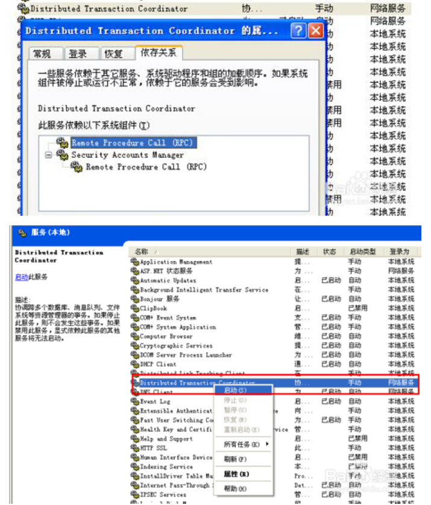

# 1.7 “新事务不能登记”等外部数据源相关
## MSDTC不可用解决方案
1. 在windows控制面版-->管理工具-->服务-->Distributed Transaction Coordinato-->属性-->启动  
确保其依赖进程均已启动  


2. 如果在第1步 Distributed Transaction Coordinator 无法启动，则是因为丢失了志文件，重新创建日志文件，再启动就行了。
### 重新创建MSDTC 日志,并重新启动服务。
```sh
msdtc -resetlog
net start msdtc
```

## OLE/DB 新事务不能登记
解决方法：  
 1. 双方启动MSDTC服务  
MSDTC服务提供分布式事务服务，如果要在数据库中使用分布式事务，必须在参与的双方服务器启动MSDTC（Distributed Transaction Coordinator）服务。

 2. 打开双方135端口  
MSDTC服务依赖于RPC（Remote Procedure Call (RPC)）服务,RPC使用135端口，保证RPC服务启动，如果服务器有防火墙，保证135端口不被防火墙挡住。  
使用“telnet IP 135 ”命令测试对方端口是否对外开放。也可用端口扫描软件（比如Advanced Port Scanner）扫描端口以判断端口是否开放。  

 3. 保证链接服务器中语句没有访问发起事务服务器的操作  
在发起事务的服务器执行链接服务器上的查询、视图或存储过程中含有访问发起事务服务器的操作，这样的操作叫做环回（loopback），是不被支持的，所以要保证在链接服务器中不存在此类操作。  

 4. 在事务开始前加入set xact_abort ON语句  
对于大多数 OLE DB 提供程序（包括 SQL Server），必须将隐式或显示事务中的数据修改语句中的 XACT_ABORT 设置为 ON。唯一不需要该选项的情况是在提供程序支持嵌套事务时。  

> 注意所有的设置更改后需要重启sqlserver服务。


 5. MSDTC设置  
打开“管理工具――组件服务”，以此打开“组件服务――计算机”，在“我的电脑”上点击右键。在MSDTC选项卡中，点击“安全配置”按钮。  
在安全配置窗口中做如下设置：  
  * 选中“网络DTC访问”  
  * 在客户端管理中选中“允许远程客户端”“允许远程管理”  
  * 在事务管理通讯中选“允许入站”“允许出站”“不要求进行验证”  
  * 保证DTC登陆账户为：NT Authority\NetworkService  


 6. 链接服务器和名称解析问题  
建立链接sql server服务器，通常有两种情况:  
  * 第一种情况，产品选”sql server”
```sql
EXEC sp_addlinkedserver
@server='linkServerName',
@srvproduct = N'SQL Server'
```
这种情况，@server （linkServerName）就是要链接的sqlserver服务器名或者ip地址。

  * 第二种情况，访问接口选“Microsoft OLE DB Provider Sql Server”或“Sql Native Client”
```sql
EXEC sp_addlinkedserver
@server=' linkServerName ',
@srvproduct='',
@provider='SQLNCLI',
@datasrc='sqlServerName'
```
这种情况，@datasrc（sqlServerName）就是要链接的实际sqlserver服务器名或者ip地址。  
Sql server数据库引擎是通过上面设置的服务器名或者ip地址访问链接服务器，DTC服务只通过服务器名地址访问链接服务器，所以要保证数据库引擎和DTC都能通过服务器名或者ip地址访问到链接服务器。 

## 无法在此会话启用更多的事务
解决方法


### 本节贡献者
*@快乐有限*  
*@訫訫*
