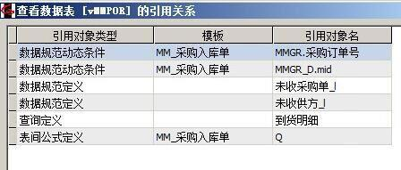

# 1.6 数据表引用关系简析
ES中的引用关系解析  
按照引用对象可以分三类，模板的引用、填写规范的引用、视图的引用。  
## 1.模板的引用
在设计模板过程中可以查看引用。  

## 2.填写规范的引用
在设计规范过程中可以右键查看引用。  

## 3.视图的引用
通过SQL语句查看引用。   

按照引用对象类型可以分四类，数据规范定义、数据规范动态条件、查询定义、表间公式定义。  
  

### 本节贡献者
*@Simplelife*
