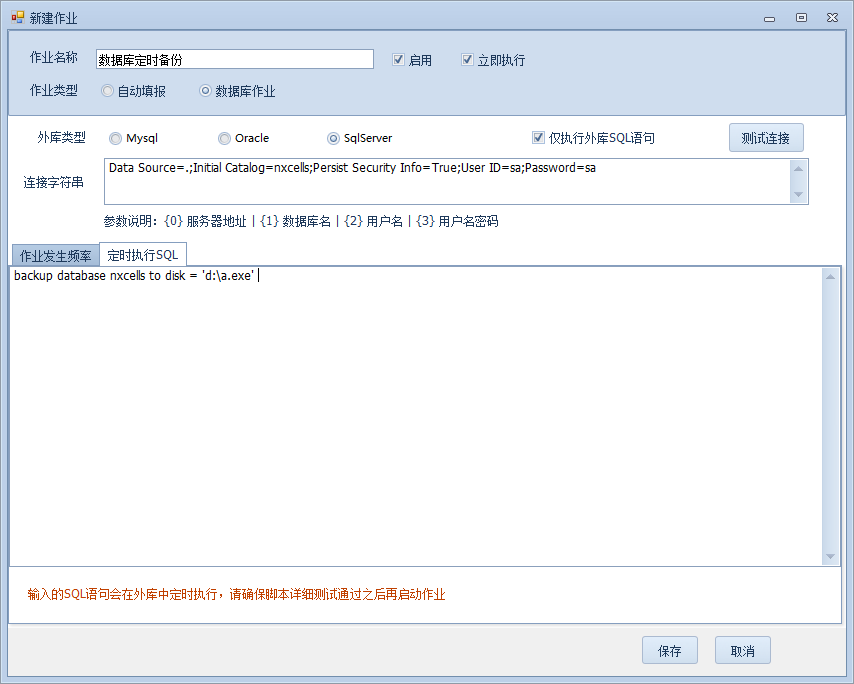

# 常见问题与技巧

## 转换ES库到NX库(骑库大法第一步)

SSMS种运行nxcells/server/upgrade/usql/下的：

`NxCreate.sql`，
`NxCreateFunc.sql`，
`NxCreateView.sql`，
`NxInit.sql`，

完成系统表注入和初始化，就可以直接新建NX账套，挂载ES库了，其他SAP/金蝶/用友同理。

## 映射已有ES表到NX工作台直接显示(骑库大法第二步)

主要是补充主表的recordid+createtime，明细的recordid+sequence

```sql
--补充主表
update 主表
	set recordid=stuff(stuff(excelserverrcid,1,4,'-'),8,1,'')
		,createtime=cast(substring(excelserverrcid,3,8) as datetime)
go
--补充明细
update 明细表
	set recordid=stuff(stuff(excelserverrcid,1,4,'-'),8,1,'')
		,sequence=excelserverrn
```

## ES图片附件迁移到JU/NX (原表映射法，骑库大法第三步))
在ES表原表增加NX图片字段，例如`员工信息表`中加入`pic`，原来的照片字段假设叫`照片`，在NX中建立模板，映射到员工信息表，照片字段映射到pic
```sql
--先把照片转化刷到pic字段，因为pic_I是int类型，需要用cast()
update 员工信息表                                           --【员工信息表】改成要更新的表
set pic=-cast(stuff(substring(照片,5,100),6,1,'') as int)  --【pic】改成NX图片字段，【照片】改成ES图片字段
,pic_I=-cast(stuff(substring(照片,5,100),6,1,'') as int)   --【pic_I】改成NX图片字段，【照片】改成ES图片字段
--插入图片系统表记录，即从ES_CasePic表迁移到JU_FileInfo
insert JU_FileInfo
select -cast(stuff(substring(picno,5,100),6,1,'') as int)
	,j.RecordID
	,'-'+stuff(substring(picno,5,100),6,1,'')+p.fileType
	,img
	,'20201222'                                            --【20201222】改成当前日期年月日    
from esap..ES_CasePic p
inner join 员工信息表 j on -cast(stuff(substring(picno,5,100),6,1,'') as int) =j.pic --【员工信息表】改成要更新的表，【pic】改成NX图片字段
--如果ES开了网盘，img是null,需要从网盘读文件导入
declare cur cursor for select -cast(stuff(substring(picno,5,100),6,1,'') as int) as fileid
	,concat('E:\esDisk\',p.RelaFolder,'\',p.PhyFileName) fp    --【E:\esDisk\】原ES网盘根目录
from ES_CasePic p
inner join 员工信息表 j on -cast(stuff(substring(picno,5,100),6,1,'') as int) =j.pic --【员工信息表】改成要更新的表，【pic】改成NX图片字段
where img is null
declare @s varchar(max);
declare @id int;
declare @fp  nvarchar(100);
set @s = '';
open cur;--打开指针
fetch next from cur into @id, @fp;
while (@@FETCH_STATUS = 0)
begin
    set @s = concat('update JU_FileInfo
set FileBinary=(
	SELECT * FROM 
	OPENROWSET(BULK ''',@fp,''', SINGLE_BLOB) as ors)
where FileID = ',@id)
    exec(@s);
    fetch next from cur into @id, @fp;--指针下移
end
close cur;--关闭指针
deallocate cur;--释放指针
```

## ES图片附件迁移到JU/NX

```sql
--更新模板图片ID
update 新表
set 图片字段=b.pic,图片字段_I=b.pic
from (
select rcid,cast(stuff(substring(照片,4,100),7,1,'') as int)as pic 
from es库..ES_CasePic
where isnull(照片,'')<>''
) b ,新表,旧表
where b.rcid=旧表.excelserverrcid and 旧表.关联号=新表.关联号
select * from 新表
--复制图片到新库
insert JU_FileInfo
select cast(stuff(substring(picno,4,100),7,1,'') as int) ,j.RecordID,stuff(substring(picno,4,100),7,1,'')+p.fileType,img,'20200603'
from es库..ES_CasePic p
inner join 新表 j on cast(stuff(substring(p.picno,4,100),7,1,'') as int) =j.图片字段
--select * from JU_FileInfo
```

## 删除ES系统表、视图、存储过程
```sql
IF object_id('tempdb..#ScanTmp') IS NOT NULL    
	DROP TABLE #ScanTmp 
GO 
CREATE TABLE #ScanTmp ( NAME varchar(100),rowid int identity(1,1)) 
INSERT INTO #ScanTmp  
	SELECT concat('drop ', iif(xtype='p','proc ',iif(xtype='v', 'view ','table ')),name) 
	FROM SYSOBJECTS WHERE left(NAME,3)='es_' 
GO 
DECLARE @TmpNo int --序号 
DECLARE @MaxNo int --最大数 
DECLARE @SQL varchar(100)   
SET @MaxNo=@@ROWCOUNT 
SET @TmpNo=1  
WHILE (@TmpNo<=@MaxNo)      --遍历 
BEGIN 
SET @SQL=(SELECT NAME FROM #ScanTmp WHERE rowid=@TmpNo) --执行删除语句 
EXEC ( @SQL ) 
SET @TmpNo=@TmpNo+1 
END 
```

## NX中的插件包
自定义菜单等功能需要插件包，下载CEF包等后解压到`server/package`，重启服务即可。

下面是配置文件config.xml

```xml
<?xml version="1.0" encoding="utf-8" ?>
<packages>
	<package id="cef" plugin="1" hook="vcredist2013_x86.exe"/>
	<package id="hik" plugin="1"/>
	<package id="jieyu" plugin="1" hook="DoccameraOcx.exe"/>
	<package id="20180420"/>
</packages>
```

重装插件可以先删除client目录下的plugin.nxpm

> NX-杨工: 做package的原理是 ，打包发到客户端去。hook是把包里的可执行程序跑一下，cef 需要c++支撑环境

## 普通微信访问企业微信中的NXAPP
第一，配置NX服务器管理器


第二，设置nx/web/index_qywx.html里面的appid到企业微信ID


第三，设置企业微信菜单


员工通过微信插件的二维码就能关注并访问了


?> 注意：新申请的企业微信不显示自建应用，需要找腾讯客服开通。

## NX工作台模糊搜索隐藏技巧
多条件搜索：`a条件|b条件`

单条件多字符匹配：`a字符%b字符`

单条件多数字匹配：`其他字符[0-9][a-z]`  

## NX中的日期有无判断
NX跟ES不同，不会因为被isnull转换过造成ES判断需要用`年(日期)=1900`这样的处理

简单直接的判断即可：

1. 对数据源(SQL)筛选时用：`目标日期字段 is null`，例如提数时明细有交期用明细交期否则用主表交期：`iif(订单明细.交期 is null, 订单主表.交期, 订单明细.交期)`

2. 对本表(SP)筛选时用：`本表日期字段 =''`，例如回写时本表明细有交期用明细交期否则用主表交期：`iif(本表订单明细.交期 = '', 本表订单主表.交期, 本表订单明细.交期)`

## 小数转文本去末尾0

> @伤疤也微笑: 用convert(float,总分)

```sql
--村长扩展:可以定义一个函数，后续直接用dbo.f_trim0(12.00)=12
create function f_trim0 (@dec decimal(32,2)) 
returns varchar(100)
as
begin
return CONVERT(varchar(100),CONVERT(float,isnull(@dec,0)))
end
```

## 字符分割函数split

> @崽团:DBO.MYSPLIT(字符串,取值位置,分隔符)，比如DBO.MYSPLIT("C10*10*20,2,"*")得到的结果就是10

```sql
CREATE FUNCTION [dbo].[mysplit] 
 (@str nvarchar(2000),--源字串
   @sn int,    --提取序号
   @Deli varchar(1) --分隔符
  )
   RETURNS varchar(100)
AS
BEGIN
declare @first int,@last int,@result varchar(1000),@sn0 int
select @sn0=0,@first=0,@LAST=1,@str=@str+REPLICATE(@DELI,1)
while @sn0!=@sn
 begin
 select @sn0=@sn0+1,@first=@LAST,@last=charindex(@DELI,@str,@LAST)+1
 end
if @last-@first-1<0
set @result=''
else
SET @RESULT=SUBSTRING(@str,@FIRST,@LAST-@FIRST-1)
RETURN ( @RESULT )
END
```

## 判断单据审批后有效的最佳实践


## 如何定期自动重存表单

> @常想一二：写个查询模板，作业定期自动填报，模板回写重存。


## sp模式模糊怎么破

字体设置：微软雅黑9号字

如果是高分屏，excel放大140%

## 关联打印纯查询模板预览不会出来

> @崽团：打印模板的表映射到原报表，关联时设置为查阅


## 控制输入时不能有空格

> @平淡人生：字段设置正则验证，`^[^\s]*$`

## 控制输入时必须有汉字(例如退回原因)

> @平淡人生：字段设置正则验证，`[\u4e00-\u9fa5]+`


## 别名引用注意事项

> @村长：如果你的模板以后会复制其他用途，还是自己定义别名吧，不要用ES/NX定义的别名，新模板会变

> Tips：ES的别名一般表是_EST开头，字段是_ESF开头，NX的别名一般表是_MT开头，字段是_MF开头

## 按系统状态分组

管理数据表本身不能直接按系统状态分组，没系统字段可选，而且像保存，审核状态后台实际是1，2这种数字。

> @村长：我们可以设置一个树形，返回-1，1，2显示全部，未审核，已审核，然后设置分组时关联这个树形即可。


## 重写系统按钮逻辑

> @村长：NX的按钮可以隐藏，例如保存，审核，打印预览等，我们可以自己设置一下按钮，勾选工具栏显示，加一些自己的逻辑，然后再调用这些隐藏的按钮即可实现重写按钮，实现一些例如记录打印次数，审核时间，保存前友情提示等功能。

## 影子模板

> @村长：NX的模板属性可以设置模板是否在客户端/移动端显示，我通常设计打印模板后会设置不显示，然后其他模板打印时关联打印这个模板，神不知鬼不觉。实现界面与打印分离。

## 协同填报

> @村长：模板属性勾选打开时为编辑状态，其他人就可以快速双击协同填报了，有时候可以代替工作流，像普通Excel一样方便

## 回写触发提数

> ES的回写是不能触发提数的，Nx只要勾选模拟填报即可实现。

## 工作流一键撤回修改

> @村长：工作流跑到一半或完结了也行，模板设置启动触发器，条件设置1=1，再加个按钮，删除ju_workflowtask中recordid等于本表单的记录，然后关联修改本记录即可，全部命令一键完成。

## 纯数组API提数

> @火星人：支持，典型的Table对象，api提数解决，表名不用刻意，i就可以了

## 重置管理员密码为空

```sql
update JU_User 
	set Password = 'e094fecbe7a6802adf7295c423c52631'
    ,[Salt]='8ab2'
where loginname='0824'
```

## 单选框字段设置为整数

> 技巧：可以在提数或报表命令里用`1-字段`来切换单选框状态，非常方便。

## 锁定界面

通常，sp界面可以鼠标滚动上下，要锁定界面，先按住ctrl键向下滚动鼠标让界面变小，再在右下区域点击一下，设置冻结，再按住ctrl键往上滚动鼠标，让界面恢复100%即可。


## 删除tmp_juxxxx临时表

因为设置失误等原因，提数回写可能会报错，并在数据库中残留tmp_juxxxx临时表，这些表用于debug，可以通过下面的脚本批量清理。

```sql
declare @deadline nvarchar(64)
set  @deadline = 't20200108' --这里的20200108改成自己需要的日期
declare @tableName nvarchar(64)  
declare tb_cur cursor for select name from SysObjects where xtype = 'U' and name like 'tmp_ju%'
open tb_cur
fetch next from tb_cur into @tableName 
  while (@@fetch_status=0) 
  begin
	  if CHARINDEX('t2',@tableName)>0 and SUBSTRING(@tableName,CHARINDEX('t2',@tableName),9)< @deadline
	  begin 
		 exec('drop table ' + @tableName)
	  end 
    fetch next from tb_cur into @tableName 
  end 
close tb_cur 
deallocate tb_cur
```

## 删除临时表对应的实体表

```sql
declare @sql nvarchar(512)
declare @tableName nvarchar(64)  
declare tb_cur cursor for select TableName from JU_TemplateTable where Created = 0 and TableType in(0,1,2)
open tb_cur
fetch next from tb_cur into @tableName 
  while (@@fetch_status=0)  
  begin
	set @sql = 'if object_id(N'''+@tablename+''',N''U'') is not null  drop table '+ @tablename +';'; 
	print @sql
    fetch next from tb_cur into @tableName 
  end 
close tb_cur 
deallocate tb_cur
```

## 调整旧库图片字段(2.9版以前升级上来的)

```sql
declare @sql nvarchar(512)
declare @tableName nvarchar(64)  
declare @fieldName nvarchar(64)  
declare tb_cur cursor for select f.FieldName,t.TableName from JU_TemplateTableField f join JU_TemplateTable t on f.TableID = t.TableID where (f.BaseDataType = 5 or f.BaseDataType = 6) and t.Created<>0 and f.Created<>0
open tb_cur
fetch next from tb_cur into @fieldName,@tableName 
  while (@@fetch_status=0)  
  begin
	set @sql = 'if col_length('''+@tablename+''','''+@fieldName+''') is not null  alter table ' + @tablename + ' alter column '+ @fieldName + ' nvarchar(128);'; 
	print @sql
    fetch next from tb_cur into @fieldName,@tableName 
  end 
close tb_cur 
deallocate tb_cur 
```

## 一键初始化(洗库)

```sql
--清空业务表数据
declare @tableName nvarchar(128) 
declare @sql varchar(2048)
declare tb_cur cursor for select distinct TableName from JU_TemplateTable where TableType in(0,1,2) and (Created = 1 or Created = 2) and tablename not in('字典表','字典表s','状态表','帮助表','帮助表s')
open tb_cur
fetch next from tb_cur into @tableName 
  while (@@fetch_status=0) 
  begin 
	set @sql = 'if exists (select * from sys.tables where name='''+ @tableName+ ''') truncate table '+@tableName  
	--exec(@sql)
	print(@sql)
    fetch next from tb_cur into @tableName 
  end 
close tb_cur 
deallocate tb_cur
--清除消息过程表
truncate table JU_AlertMessage
truncate table JU_AlertRun
truncate table JU_AutoCodeDisused
truncate table JU_AutoCodeRegister
truncate table JU_AutoReportRun
truncate table JU_BackupPlan
truncate table JU_BaiduFaceIdentify
truncate table JU_FileInfo
truncate table JU_Message
truncate table JU_SMS
truncate table JU_SysLog
truncate table JU_SysDebugLog
truncate table JU_WebChatMsg
truncate table JU_WeChatMessage
truncate table JU_WeChatPay 
truncate table JU_WorkflowInstance
truncate table JU_WorkflowTask
truncate table JU_WorkflowTaskLog
--复原种子
update JU_ReportSeed set Seed = 100 
update JU_Seed set Seed = 100 where Keyword = 'JU_Report.RecordID'
update JU_Seed set Seed = 100 where Keyword = 'JU_AlertMessage.AlertMsgID'
update JU_Seed set Seed = 100 where Keyword = 'JU_AlertRun.AlertID'
update JU_Seed set Seed = 100 where Keyword = 'JU_AutoCodeDisused.DisusedID'
update JU_Seed set Seed = 100 where Keyword = 'JU_AutoCodeRegister.AutoCodeID'
update JU_Seed set Seed = 100 where Keyword = 'JU_AutoReportRun.AutoRunID'
update JU_Seed set Seed = 100 where Keyword = 'JU_BackupPlan.PlanID'
update JU_Seed set Seed = 100 where Keyword = 'JU_FileInfo.FileID'
update JU_Seed set Seed = 100 where Keyword = 'JU_Message.MessageID'
update JU_Seed set Seed = 100 where Keyword = 'JU_SMS.MsgID'
update JU_Seed set Seed = 100 where Keyword = 'JU_SysLog.LogID'
update JU_Seed set Seed = 100 where Keyword = 'JU_WebChatMsg.JUMsgID'
update JU_Seed set Seed = 100 where Keyword = 'JU_WeChatMessage.MsgId'
update JU_Seed set Seed = 100 where Keyword = 'JU_WorkflowInstance.InstanceID'
update JU_Seed set Seed = 100 where Keyword = 'JU_WorkflowTask.TaskID'
update JU_Seed set Seed = 100 where Keyword = 'JU_WorkflowTaskLog.WorkflowLogID' 
```

## 模板异常：office检查到此文件存在一个问题。要帮助保护您的计算机，不能打开此文件。

>@废柴：如果是Office2013，要勾选COM加载项的Microsoft Office PowerPivot for 2013，如果是Office2010，可以考虑换成Office2007试试。

## 索引超出了范围，设计器出现红叉。

>@天涯：区域不连续时，容易出现这个错误提示，看下管理数据表定义区域是否整齐。

## 使用esap启动FRP
```
insert esap_cx(name,mkey,tmpl,acluser,aclapp,recordid,createtime)
select 'startfrp','startfrp',N'{{if run "frp/restart.bat"}}select N''失败''{{else}}select N''启动成功 12345''{{end}}','@all','@all',-100,getdate()
union all
select 'stopfrp','stopfrp',N'{{if run "frp/stop.bat"}}select N''失败''{{else}}select N''停止成功''{{end}}','@all','@all',-101,getdate()
```

## 错误：对象不能从DBNull转换为其他类型。

>@火星人：执行下面的SQL，DBNULL 一般错误是系统字段没给默认值导致的

`update JU_TemplateTableField set AllowEditSysVar = 0`

`update JU_ActionStep set IsDisable = 0`

## 错误：提示XXXX正在办理

>@火星人：执行下面的SQL，检查办理权

`select TaskState,Locked,DealUser,* from ju_workflowTask  正常待办  TaskState = 0 Locked = 0 DealUser = null`

## 办理时出现错误：远程主机强迫关闭一个连接

办理的步骤：

* SELECT * FROM JU_WorkflowTask WHERE TaskID = ?  找到任务 ，检查任务状态，锁状态，办理人

* SELECT LockStatus FROM JUT110 WHERE RecordID IN (SELECT RecordID FROM JU_WorkflowTask WHERE TaskID = ? )   检查任务对应的报表的锁状态 

* UPDATE JU_AlertMessage SET MsgState = 0 WHERE MsgRefID = ?);
            //办理之后将消息设置成已阅状态

* UPDATE JU_Message set ReadTime=getdate(),MsgStatus =1 where MsgType = 1 and RefExpr = ?    将任务关联消息状态改变 。

* UPDATE JU_WorkflowTask SET Locked ={0} , DealUser ={1} WHERE TaskID ={2}   给任务加上处理锁 

检查相关表数据是否过大。

## NX图片压缩
客户端-模板属性-勾选允许存缩略图，图片将自动压缩为模板上画布大小

移动端-我-设置，可以设置上传图片的压缩比例


## NX直接解析对象
> @芳草无情：类似{key:value}，而不是{data:[]}的json,解析时json对象填 `+` 号即可


## 回写修改经常失败
> @火星人：明细需要加主键

## 表单删除了，工作流待办还在
> @火星人：删除一下task: `delete from JU_WorkflowTask where RecordID=待办里的报表ID`

## 账号工作交接时显示某表无效
> @火星人：检查数据库中是否还有这个表，`SELECT TableName FROM JU_TemplateTable WHERE TableType = 0 and Created > 0`

## 主表日期不能convert(112)，明细可以
> @火星人：主表是临时表，没有过sql，可以强制过一下：`convert(varchar(10),cast(本报表.[日期转换测试表].[日期] as datetime),112)`

## 主表全部设置模糊查询
如果勾选过主表字段 ，就默认你得勾选 。  否则主表字段都给默认模糊
```sql
--主表模糊查询兼容
UPDATE JU_TemplateTableField SET  AllowLikeSearch = 1 WHERE Hidden = 0 and Created >= 1 and TableID in(
select TableID from JU_TemplateTable where Created >= 1 and TableType = 0) and TableID not in(
SELECT distinct TableID FROM JU_TemplateTableField WHERE AllowLikeSearch = 1 and Hidden = 0 and Created >= 1 and TableID in(
select TableID from JU_TemplateTable where Created >= 1 and TableType = 0))
```

## 查询有那些服务器使用了当前库
如果勾选过主表字段 ，就默认你得勾选 。  否则主表字段都给默认模糊
```sql
--主表模糊查询兼容
select t2.name as 数据库名,t3.client_net_address as ip地址,
t1.host_name as 电脑名 
from master.sys.dm_exec_sessions t1
inner join master.dbo.SYSDATABASES t2 on t1.database_id=t2.dbid
inner join master.sys.dm_exec_connections t3 on t1.session_id=t3.session_id where t2.name = 'nxcells' --nxcells改成自己的库
```

## 一句话作业备份，可整理外库



作业定时执行


## 序号函数
> @crosstime:提供一个序号函数 
配合表唯一字段排序使用 可得到正常序号
dense_rank() over(order by 表唯一字段)
配合表不唯一字段排序使用
dense_rank() over(order by 表不唯一字段) 可得到便于合并的相同顺序号


> tips:相似功能函数列表：ROW_NUMBER、RANK、DENSE_RANK、NTILE
