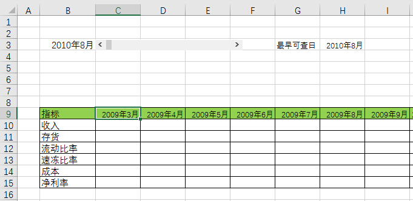
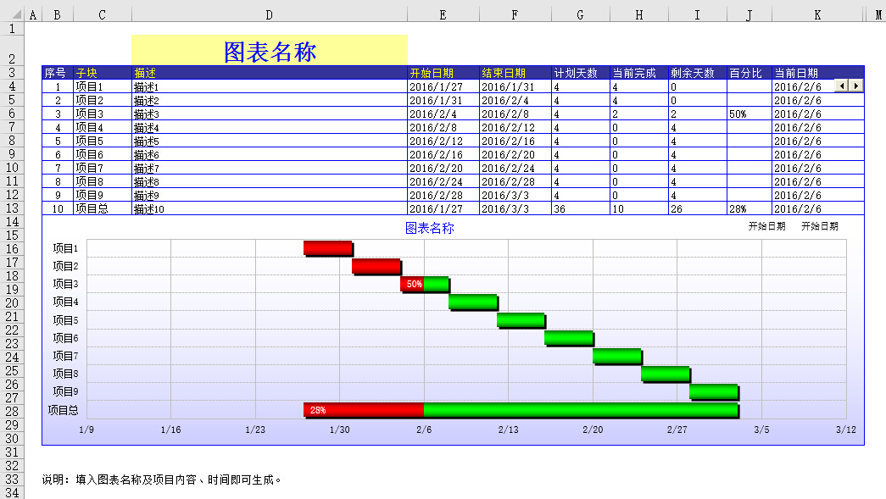
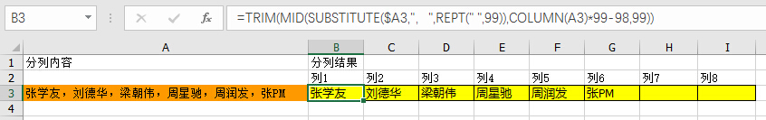
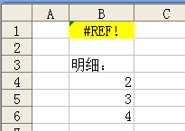

# 2.2 EXCEL应用汇

## 计算周末数量
    

## 玩转日期加减滚动

- Excel下载：  
[下载地址](/src/2.2.2.xlsx)

## EXCEL也能百度一下

- Excel下载：  
[下载地址](/src/2.2.3.xlsx)

## 像素圆角(不用插入图形也能画圆角矩形)

- Excel下载：  
[下载地址](/src/2.2.4.xls)

## 甘特图生成器(项目进度管理)

- Excel下载：  
[下载地址](/src/2.2.5.xls)

## 输入时逐步提示信息(两个及以上)

- Excel下载：  
[下载地址](/src/2.2.6.xls)

## 函数打印条形码示例

- Excel下载：  
[下载地址](/src/2.2.7.xls)

## 表格实现凹凸按钮效果

- Excel下载：  
[下载地址](/src/2.2.8.xls)

## 计算一个月有多少天

## 渐变填充应用研究
> @柳亚子  

[下载地址](/src/2.2.10.xls)

## 唯一计数
区域文字的唯一计数  
	=SUMPRODUCT(1/COUNTIF(区域,区域))

## 计算季度
> =TEXT(MONTH(日期单元格)*10,"[dbnum1]m季度")

## 单元格内容分列
> @张PM  
   
> =TRIM(MID(SUBSTITUTE($A3,"，",REPT(" ",99)),COLUMN(A3)*99-98,99))

## 防止直接引用单元格删除后出错
> @张PM  
  
 
> @Kang   
> =OFFSET(B2,2,0)  
> @淡淡风   
> =INDIRECT("B4")   

### links
  * 上一节: [上一节](<02.1.md>)
  * 下一节: [下一节](<02.3.md>)
