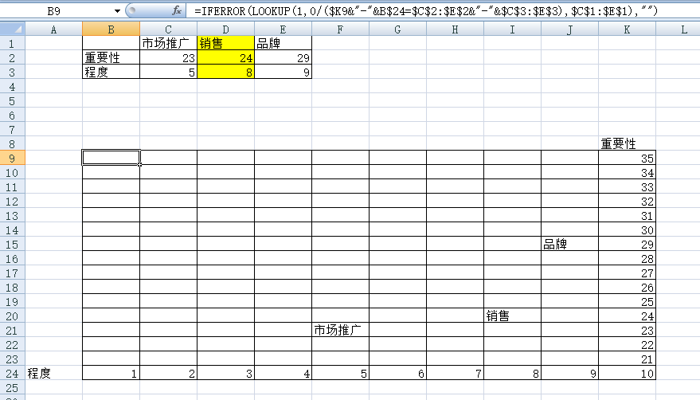
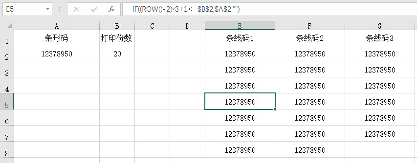
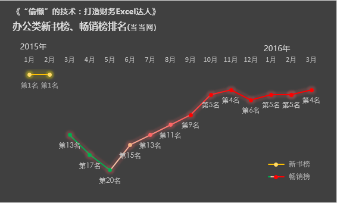
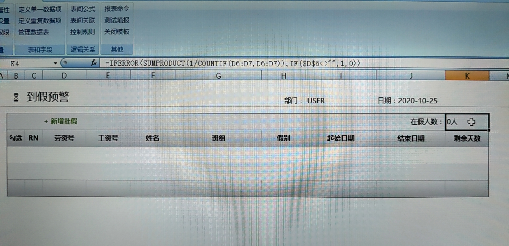

# 2.2 EXCEL应用汇

## 坐标定位效果
> @王达

> =IFERROR(LOOKUP(1,0/($K9&"-"&B$24=$C$2:$E$2&"-"&$C$3:$E$3),$C$1:$E$1),"")

## 行转列
> @rayman

> @上天入地
公式改一下以便支持更多行：
=TRIM(MID(SUBSTITUTE(A$1,">",REPT(" ",LEN(A$1))),(ROW(A1)-1)*LEN(A$1)+1,LEN(A$1)))

## 计算周末数量
    

## 玩转日期加减滚动

[Excel下载](c2/02/2.2.2.xlsx ':ignore')

## EXCEL也能百度一下

[Excel下载](c2/02/2.2.3.xlsx ':ignore')

## 像素圆角(不用插入图形也能画圆角矩形)

[Excel下载](c2/02/2.2.4.xls ':ignore')

## 甘特图生成器(项目进度管理)

[Excel下载](c2/02/2.2.5.xls ':ignore')

## 输入时逐步提示信息(两个及以上)

[Excel下载](c2/02/2.2.6.xls ':ignore')

## 函数打印条形码示例

[Excel下载](c2/02/2.2.7.xls ':ignore')

## 表格实现凹凸按钮效果

[Excel下载](c2/02/2.2.8.xlsx ':ignore')

## 计算一个月有多少天

## 渐变填充应用研究
> @柳亚子  

[Excel下载](c2/02/2.2.10.xlsx ':ignore')

## 唯一计数
区域文字的唯一计数

	=SUMPRODUCT(1/COUNTIF(区域,区域))

> @crosstime:

## 计算季度
	=TEXT(MONTH(日期单元格)*10,"[dbnum1]m季度")

## 单元格内容分列
> @张PM  

 
	=TRIM(MID(SUBSTITUTE($A3,"，",REPT(" ",99)),COLUMN(A3)*99-98,99))

## 防止直接引用单元格删除后出错
> @张PM  
  
 
> @Kang   
> =OFFSET(B2,2,0)  
> @淡淡风   
> =INDIRECT("B4")   
