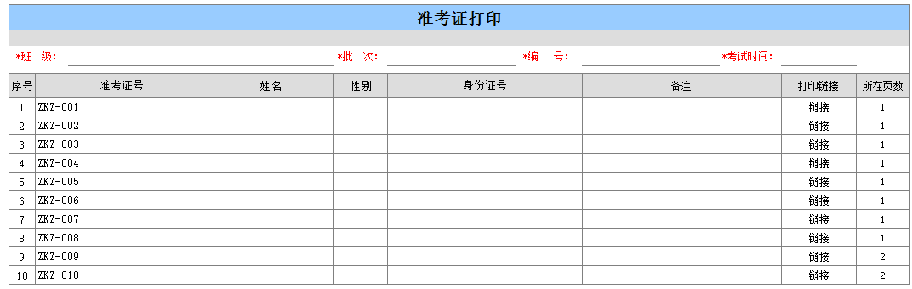
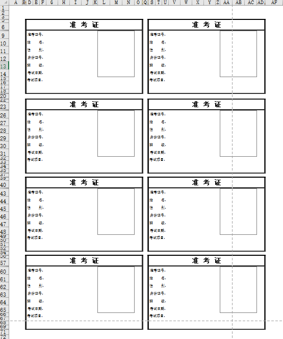

# 2.8 Excel批量打印卡证的方法
## 需求
批量选择信息，打印卡证类，例如考生准考证，员工证等

准考证8人打印一张A纸上

## 方法一
两个模版A：准考证打印  B:准考证

所在页数公式：`=IF(C7="","",INT(B7/8.1)+1)`

先填报A，保存，A明细链接到B,传参数<唯一单号>、<所在页数>到B

B用8个提数公式提取8个身份证号，`条件1.序号=8*(所在页数-1)+1、条件2.序号=8*(所在页数-1)+2 ….条件8.序号=8*(所在页数-1)+8`

#### 下载
[Excel下载](c2/08/2.8.xls ':ignore')

## 方法二
采用跟 ES 官方分层汇总表类型的原理，使用辅助表，通过提数实现数据分块

#### 下载
[模板下载](c2/08/2.8.3.rar ':ignore')

### 本节贡献者
*@张PM*  
*@昆明haotian*  
