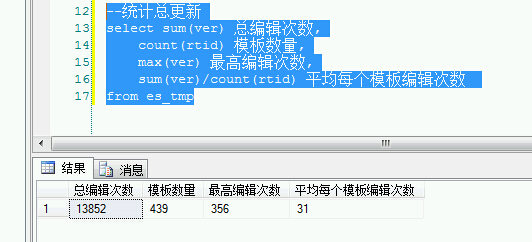
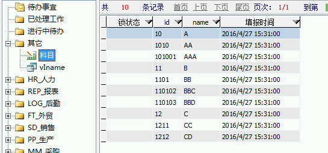
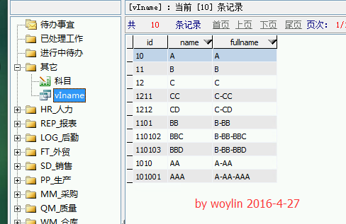
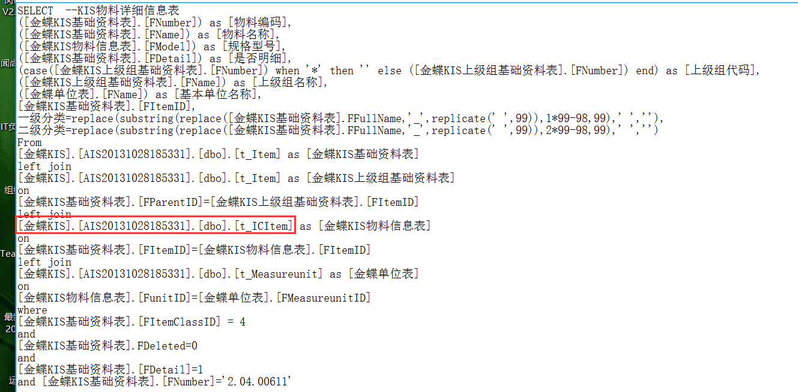

# 3.1 SQL应用汇

## 应付账款账龄计算公式
> @简单生活  
```sql
---查询应收应付账龄
SELECT
	类型,
	简称,
	SUM (应收付金额) '应收付金额',
	---0 AS '账期内本币金额',
	'Days30' = SUM ( CASE WHEN 逾期天数 >= 0 AND 逾期天数 < 30 THEN 应收付金额 ELSE 0 END	 ),
	'Days60' = SUM ( CASE WHEN 逾期天数 >= 30 AND 逾期天数 < 60 THEN 应收付金额 ELSE 0 END ),
	'Days90' = SUM ( CASE WHEN 逾期天数 >= 60 AND 逾期天数 < 90 THEN 应收付金额 ELSE 0 END ),
	'Days180' = SUM ( CASE WHEN 逾期天数 >= 90 AND 逾期天数 < 180 THEN 应收付金额 ELSE 0 END ),
	'Days270' = SUM ( CASE WHEN 逾期天数 >= 180 AND 逾期天数 < 270 THEN 应收付金额 ELSE 0 END ),
	'Days360' = SUM ( CASE WHEN 逾期天数 >= 270 AND 逾期天数 < 360 THEN 应收付金额 ELSE 0 END )
FROM
	vFI_RP
GROUP BY
	类型,
	简称
```

## 统计ES开发
据说高手的平均模板编辑次数不超过10次，你做到了吗？  
  
> @挨踢熊  
```sql
--统计模板更新
select rtid,
	rtno 编号编号,
	rtname 模板名称,
	classid,
	creuname 创建人,
	cretime 创建时间,
	updtime 更新时间,
	ver 
from es_tmp
order by ver desc
--统计总更新
select sum(ver) 总编辑次数,
	count(rtid) 模板数量,
	max(ver) 最高编辑次数,
	sum(ver)/count(rtid) 平均每个模板编辑次数 
from es_tmp
```

## 查看数据库各表所占空间大小（分析优化必备）
```sql
CREATE TABLE #a (name varchar(265),
        rows bigint,
        reserved varchar(265),
        data varchar(265),
        index_size varchar(265),
        unused varchar(265)
)
EXEC sp_msforeachtable 'INSERT INTO #a exec sp_spaceused''?'''
SELECT * FROM #a order by rows desc
drop table #a
```

## SQL根据身份证判断性别


## 恢复工作台记录丢失
工作台偶尔有记录会丢失，但数据库中却存在  
```sql
insert into es_repcase (rcid,rtId,fillDept,fillDeptName,fillUser,fillUserName,state,
lstFiller,lstFillerName,lstFillDate,wiId)
select excelserverRcid,excelserverRtId,u.deptId,u.deptName,u.userId,u.userName,1,
u.userId,u.userName,getdate(),excelserverWiId
from 销售订单主表 a,es_v_user u
where excelserverrcid not in (select rcid from es_repcase)
and a.录入人=u.userName
```

*注意：代码中的`销售订单主表`改成丢失记录模板的主表名称*

## 恢复卡住的工作流
工作流很容易在办理时因强退或其他原因卡在**进行中待办**且不易被发现  
可以通过设置定时自动任务或SQL代理扫描恢复  
```sql
--恢复卡住的工作流
update ES_WorkItem
set state=0
where state=1 and not exists (select * from ESSystem..ES_SesLog where UserId=ES_WorkItem.CheckOutBy)
--查询卡住的工作流
select a1.*,a2.ip from ES_WorkItem a1 left outer join ESSystem..ES_SesLog a2 
on a1.CheckOutBy = a2.UserId
where a1.state=1 
--查询卡住的工作流详情(含任务名称)
SELECT A1.wiId , A1.CreByName, A1.State,
      A1.CheckOutByName, A1.ComByName, A3.pName, 
      A4.IP, A1.CreDate, A1.state1,A1.RCID,A5.rcDesc
FROM dbo.ES_WorkItem A1 
INNER JOIN dbo.ES_WfCase A2 ON A1.piId = A2.piId 
INNER JOIN dbo.ES_WorkFlow A3 ON A2.pId = A3.pId 
LEFT OUTER JOIN ESSystem.dbo.ES_SesLog A4 ON A1.CheckOutBy = A4.UserId 
left outer join dbo.ES_RepCase A5 ON A1.rcid = A5.rcid
WHERE (A1.State = 1)
```

## 批量修改模板保存后自动关闭
```sql
UPDATE es_tmpprop
set closeaftersave=1
```

## 查询待办事宜
> @Kang
```sql
 SELECT A1.wiid AS 工作流序号,
       A1.CreByName AS 创建人,
       A1.State AS 工作流状态,
       A1.CheckOutByName AS 进行人,
       A1.ComByName AS 暂存人,
       A1.State1 AS 暂存状态,
       A1.CreDate AS 创建时间,
       A3.PName AS 描述,
       A1.WiDesc AS 说明,
       A4.IP,
       A6.username AS 待办人,Email
FROM dbo.es_workitem A1 
     INNER JOIN dbo.es_wfcase A2 ON A1.piid = A2.piid 
     INNER JOIN dbo.es_workflow A3 ON A2.pid = A3.pid 
     LEFT JOIN ESSystem.dbo.ES_Seslog A4 ON A1.checkoutby = A4.UserId 
     LEFT JOIN es_Witodo AS A5 ON A1.Wiid=A5.wiid 
     LEFT JOIN es_user AS A6 ON A5.userid=A6.userid
WHERE (A1.State<>2)
```

## 解决存储过程调用异常(连接无法用于执行此操作)
> @Meteor  


> @Kang  
```sql
SET NOCOUNT ON 
--原存储过程
SET NOCOUNT OFF
```

## 递归查询科目全称(asked by @昆明haotian) 




```sql
--select id, name from iName --iName是原表，只有科目代码id,和科目名称name
--go
--以下为视图代码
with iName2(id,name,fullname) as 
(
	select ID, name, CAST(name as varchar(4000)) from iName where LEN(id)=2
	union all
	select a.id, a.name, CAST(b.fullname +'-'+ a.name as varchar(4000))
		from iName a, iName2 b where LEFT(a.id, LEN(a.id)-2)=b.id 
)
select id,name,fullname from iName2 --求得全称
```

## 外部数据源中的视图如何使用(asked by @訫訫) 


>@清风 直接写SQL，注意路径：[外部数据源名称].[数据库实体名].[表]

### links
  * 下一节: [下一节](<03.2.md>)
