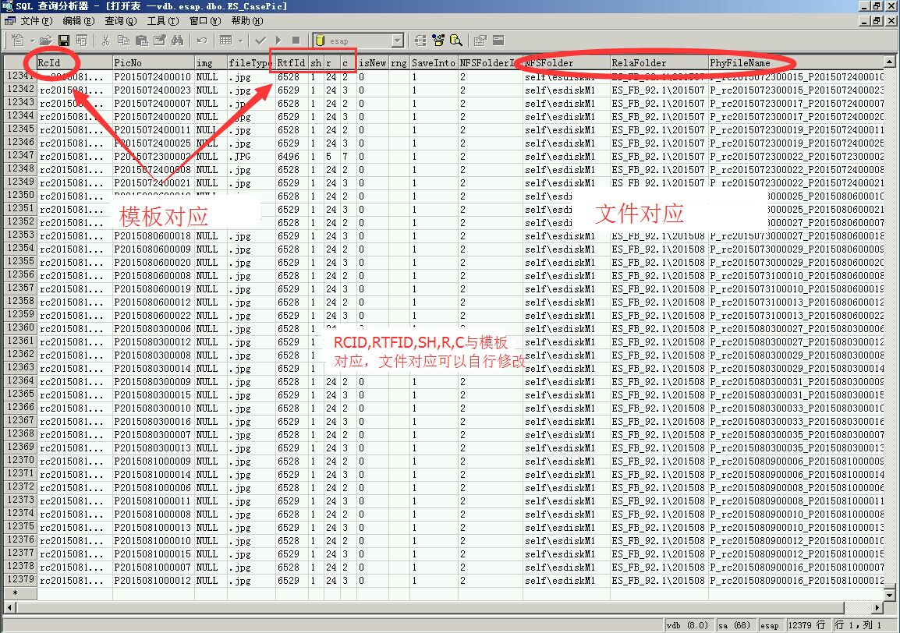

# 3.8 ES存储图片的机制

### 字段简析
* rcid			表单的ExcelServerRCID
* rtfid			图片字段的系统id
* sh			图片字段的sheet
* r				图片字段的row，行号
* c				图片字段的column，列号
* NFSFoler		网盘根目录
* RelaFoler		存储子目录
* PhyFileName	文件名

其他字段一般照抄即可

### links
  * 上一节: [上一节](<03.7.md>)
  * 下一节: [下一节](<03.9.md>)
