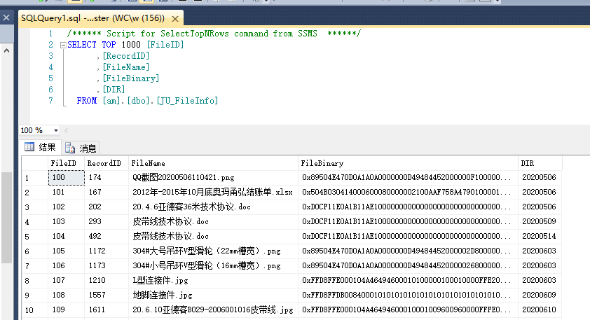

# 3.8 存储图片的机制

## NX机制

#### 字段简析
* FileID			文件ID(含图片/附件)
* RecordID			表单ID
* FileName			文件名
* FileBinary		文件(二进制)
* DIR			    文件目录

## ES机制

#### 字段简析
* rcid			表单ID
* rtfid			图片字段的系统id
* sh			图片字段的sheet
* r				图片字段的row，行号
* c				图片字段的column，列号
* NFSFoler		网盘根目录
* RelaFoler		存储子目录
* PhyFileName	文件名

其他字段一般照抄即可
