# 3.1 NXCELLS修改图标经验分享

> 版本：v3.4.2
> 整理：李乐东
> 日期：2019年11月20日

## 致谢

感谢村长，感谢杨工，感谢Nxcells聚慧禅院、nxcells技术交流群，感谢一起成长的小伙伴！

## 前言

群里小伙伴很早就有替换图标的方法，详见《聚表登陆背景及logo替换OEM》。

我第一次修改NX的界面是在2019年6月份，版本是3.1.5，当时已经可以很方便替换图标，还是有一小丢丢问题，我先后跟杨工请教了3次问题：

* 2019-6-14 修改替换的图标应该存放在服务器nxcells安装目录client/img，而不是/server/img

* 2019-07-1 覆盖升级NX服务端，建议不覆盖client/img目录，不然会覆盖之前DIY的图标

* 2019-07-1 原尺寸修改替换brand.png，客户端工作台界面显示模糊，后面版本已经优化

## 一、DIY图标

NXCELLS可以自定义4个图标，文件在NxCells\client\img，只要把修改好的图标覆盖在服务器的对应目录，即可自动分发到客户端。

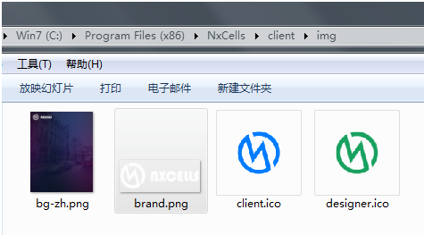

杨工给建议：

|文件|用途|尺寸|建议|
|:----|:--:|:--:|:--:|
|client.ico|客户端图标|||
|designer.ico|设计器图标||建议背景色偏黑|
|bg-zh.png|登录界面背景|宽：515px 高：664px|建议内容白色背景透明|
|brand.png|主界面左上方横幅图标|宽：自适应 高：40px||

#### （一）制作client.ico或者designer.ico

1、用Photoshop打开要处理的图片，清除不需要的底色

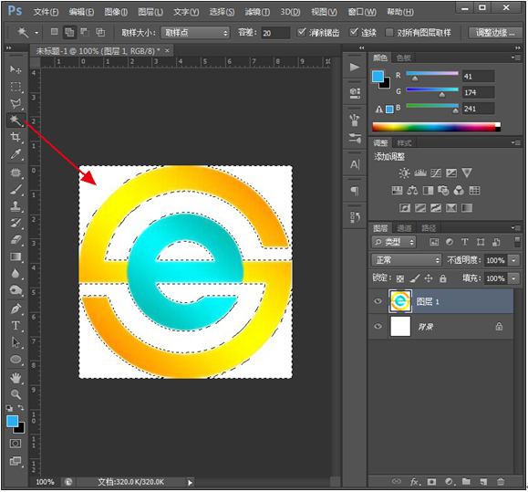

2、存储为png格式

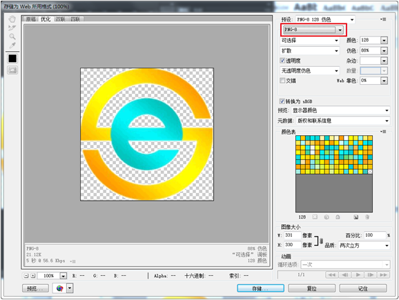

3、百度“ico在线”，找一个在线制作ico的网站

4、上传png图片，我建议目标尺寸选大的（128x128），点生成ico图标

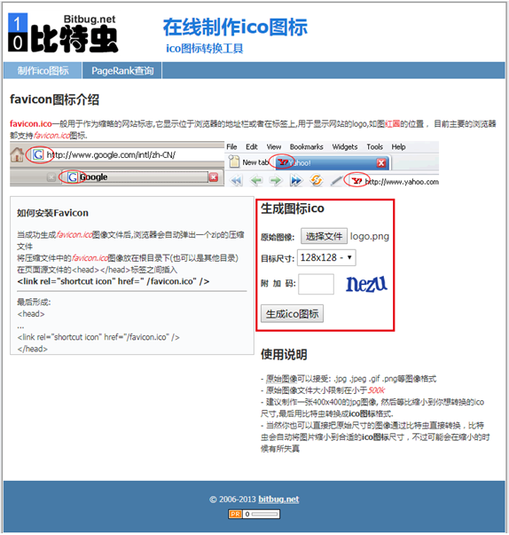

5、三个图标列队一排，看看效果

6、成品效果

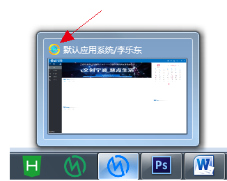

> PS：

> 1、	我看过同事的电脑，有的状态栏可以显示自定义的图标，有的跟我电脑一样，只能显示状态栏窗口的小图标，具体原因我没深入研究

> 2、	我个人理解替换ICO图标，应该桌面图标的显示效果也改变，参考上面【第5点】的效果，至今我还没有实现过，囧

#### （二）制作bg-zh.png

1、百度“免费素材psd”， 找素材网站

2、推荐2个素材站点，免费的

* 站在素材[http://sc.chinaz.com)

* 素材中国[http://www.sccnn.com)

3、找到自己喜欢的素材，并下载psd文件

为了搭配NX工作台的蓝色主题，我一般会搜索“科技”、“蓝色”等关键字

4、用Photoshop打开刚才下载好的psd文件，清除不需要的元素，裁剪比例设置为515x664，裁剪图像后，调整图像大小：宽：515像素 ，高：664像素，分辨率：72像素

5、 添加公司logo，名称等信息

6、 存储png格式，记得再检查一遍图像大小

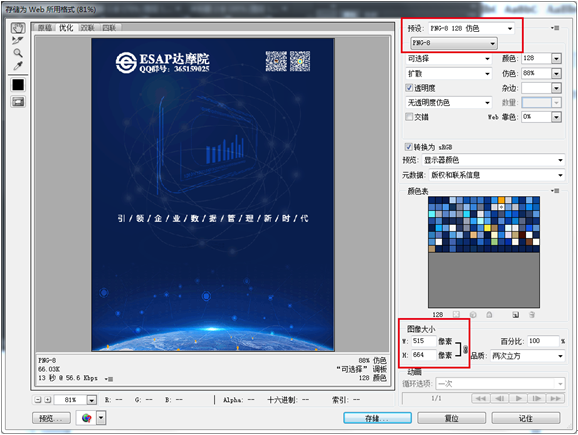

7、成品效果——登录界面

8、成品效果——设置界面

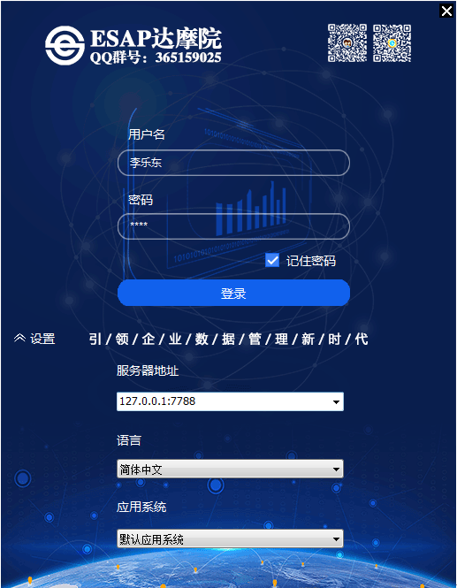

#### （三）制作brand.png

1、NX的brand.png尺寸是宽：100px 高：40px。前面杨工也提示过，宽度是自适应的，所以实际应用，我们可以根据需要设计图片的宽度，高度要保持40px

2、为了搭配NX工作台的蓝色主题，我们参考NX原稿文件，把图片设计为透明底色，白色的logo

3、用Photoshop打开brand.png，为便于观察效果，添加一个图层，填充背景色为R0,G112,B193

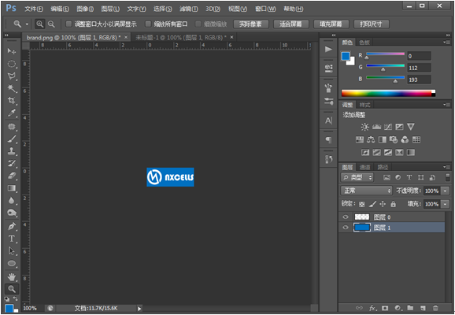

4、根据需要设置布画大小的宽度

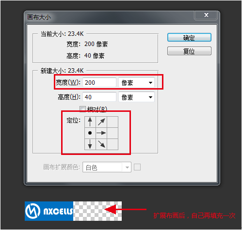

5、添加公司logo，名称等信息，删除不要的图层

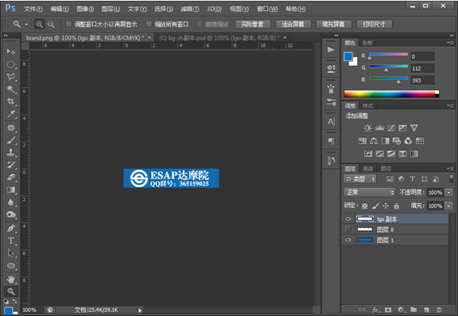

6、 存储png-24格式，记得再检查一遍图像大小，高度40px
（请注意！如果背景为透明！一定要存png-24格式！）

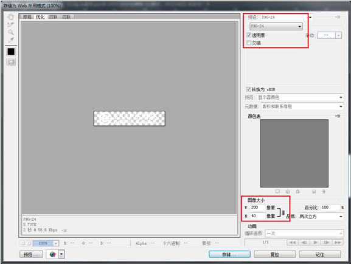

7、成品效果

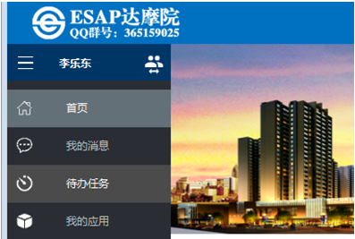

8、我们也可以换成不透明的设计图片或者实景图片，就是……长度有点……不好把握……

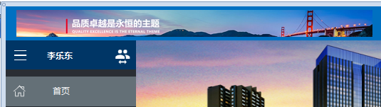

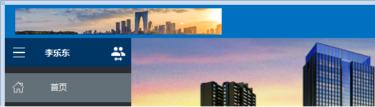

## 二、DIY工作台轮播图片
1、NXCELLS的工作台轮播图片，文件在NxCells\server\picture，只需把图片放在这个目录下就可以了

2、图片尺寸我建议调整跟原稿一样，宽：1200px 高：313px

3、图片格式支持png、jpg，大家可以尝试别的的图片格式

3、	图片可以放多张，默认按文件名称排序展示
（好像只能展示第一张，囧，希望杨工以后增加可以设置时间切换展示）

5、成品效果
 

6、工作台效果

## 本节贡献者

@李乐东

2019-11-21
