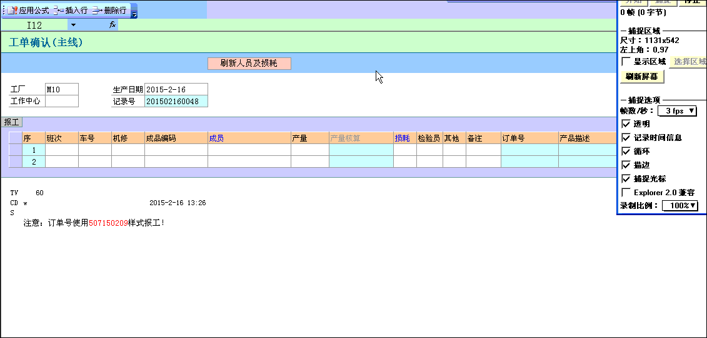

# 5.10 超链接跳转填报及返回刷新示例
  
原理：   
1. 通过 workbook_windowActivat触发返回时刷新  
2. 通过 M 函数检查当前表单打开方式 ，只在填报或修改时触发提公函数Qpphp() 
 
```vb
'thisworkbook中的代码
Private Sub Workbook_WindowActivate(ByVal Wn As Window)
	Call M(Wn.Caption)
End Sub
'插入一个模块，填入下面函数代码
Sub Qpphp()
    Application.COMAddIns("esclient10.connect").Object.execquery "提数公式1,提数公式2"
End Sub
	
Sub M(str As String)
    If InStr(str, "填报：") > 0 Or InStr(str, "修改：") > 0 Then Qpphp
End Sub
```

> 注意，被超链接的模板要勾选保存后关闭选项，该方案在es2010版可行，2015版+无效(新版ES屏蔽了事件，鄙视(╬▔皿▔)凸)
### links
  * 上一节: [上一节](<05.9.md>)
  * 下一节: [下一节](<05.11.md>)
