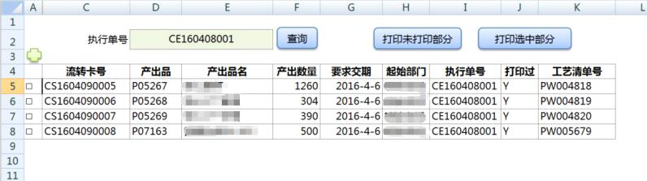

# 5.11 复选框多选列表的实现
Excel中实现如下界面效果，仿web界面的复选后，对选中的记录集进行操作。

(复选框要根据提数公式的结果集自动匹配)

 
 
 

### 实现思路和版本要求
1. Excel2007以上  
2. VBA函数: DynamicCheckbox.  

参数含义: 
	sht---列表所在的sheet页,  
	dataRng---列表数据区域,  
	chkboxCol--复选框所在列号:A,B,C,…..   
	valueCol--复选结果TRUE FALSE 所在列(复选框联动的结果列),  
	startRow--起始行号,  
	endRow--终止行号  
	
```vb
Private Sub DynamicCheckbox(sht As Worksheet, dataRng As Range, chkboxCol As String, valueCol As String, startRow As Integer,endRow As Integer)
	Application.ScreenUpdating = False
	sht.CheckBoxes.Delete
	Dim i As Integer
	Dim rng As Range
	For i = startRow To endRow
		Set rng = Range(chkboxCol + CStr(i))
		With sht.CheckBoxes.Add(rng.Left, rng.Top, rng.Width, rng.Height)
			.Text = ""
			.LinkedCell = valueCol + CStr(i)
		End With
	Next
	Application.ScreenUpdating = True
	dataRng.FormatConditions.Delete
	Dim fml As String
	fml = "=$" + valueCol + CStr(startRow) + "=TRUE"
	Range("$" + valueCol + CStr(startRow)).Select
	With dataRng.FormatConditions.Add(Type:=xlExpression, Formula1:=fml)
		.Interior.PatternColorIndex = xlAutomatic
		.Interior.Color = RGB(217, 254, 255)
	End With
	End Sub
Public Sub ClearChkbox()
	Sheet1.CheckBoxes.Delete
End Sub
'调用示例:
Public Sub Query()
	Dim oAdd As Object
	Set oAdd = Application.COMAddIns("ESClient10.Connect").Object
	oAdd.execQuery ("T1") '执行提数公式
	Set oAdd = Nothing
	Dim lrow As Integer
	lrow = Range("C3").End(xlDown).Row '得到提数结果的最后一行
	'调用生成复选框
	If (lrow >= 5) Then
		DynamicCheckbox Sheet1, Range("C5:I" + CStr(lrow)), "A", "B", 5, lrow
		'没有数据的情况下,清除所有复选框
	Else
		ClearChkbox
	End If
End Sub
'批量操作:(比如批量打印,要选到选中的记录)
Public Sub PrintChecked()
	Dim i As Integer
	Dim lrow As Integer
	lrow = Range("C3").End(xlDown).Row
	If (lrow <= 4) Then
		MsgBox "无数据"
		Exit Sub
	End If
	For i = 5 To lrow
		If (Range("B" + CStr(i)) = "True") Then
			Sheet2.Range("C1") = Sheet1.Range("C" + CStr(i))
			Sheet2.PrintOut
			Sheet1.Range("J" + CStr(i)) = "Y"
		End If
	Next
	Dim oAdd As Object
	Set oAdd = Application.COMAddIns("ESClient10.Connect").Object
	If (oAdd.execUpdate("UPrnStatus") = True) Then MsgBox "打印完成"
	Set oAdd = Nothing
End Sub
```

### 本节贡献者
*@Meteor*
