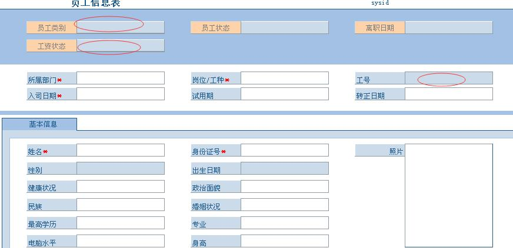
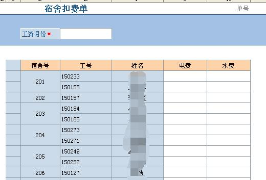
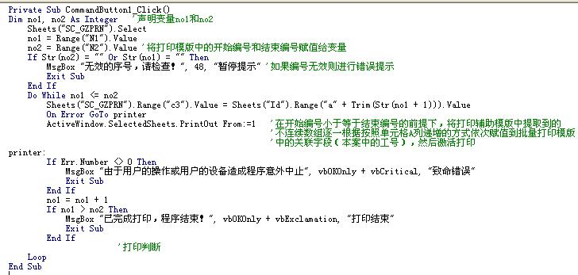
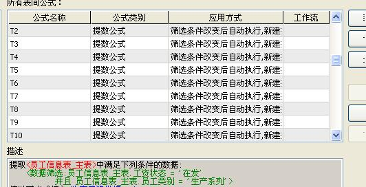

# 5.5 非连续数据的批量打印
本案适用于数据编号的不连续打印  
* 案例
因工号的自动编号并不是采用+1‐递增的生成方式，所以工号在本公司是不连续的，而实际操作过程中很多公司可能会因误删或者技术性删除而导致部分数据的不连续，本案采用工号的编号方式是”YYMM”+”两位顺序数字”，（如150201）  

* 需求：批量打印这类工号所对应的生产月份的工资数据，包括计件计时工资的明细数据和工资条数据。  
## 1.本案所用到的数据表，人力资源里用到员工信息表  
 * 通过信息表中的工资状态（在发、停发）和员工类别（行政系列、生产系列）的判断来提取当月生产系列员工  

 * 通过生产报工单提取生产员工的计时计件数据  

 * 通过补充工资，宿舍扣费和扣款实现工资表中所涉项目的数据  

为了便于理解各数据表数据定义项，现将各模版展示如下

## 2.本案中所用到的批量打印模版（不创建数据字段到数据库）
- 2.1 为批量打印模版  

- 2.2 为打印辅助模版（用以提取符合条件的不连续数组）  

## 3.实现方法和原理
- 第一步：提取不连续的工号数据到打印辅助模版，形成待用数组  
- 第二步：通过VBA代码实现打印辅助模版和批量打印模版间的关键数据传输（本案中关键数据为工号）  

通过本步可以逐一把辅助模版中的不连续数组一次按行列号增大的方式赋值到打印模版中  
- 第三步：通过各类提取公式，从相关数据表中提取符合条件的数据到打印模版中，（工号是关键）  
我使用了12条提数公式  

工号变化了，提数公式会把对应工号的数据提取到打印模版上  
最后，模版成型后，只需要输入数组中第一个数据的行列号，以及最后一个数据的行列号即可，请确保打印机内有足够纸张。  
记住把打印模版所需打印的区域设置成 打印区域，否则的话，请准备好很多的纸，以及烧爆激光管的准备。

### pdf资料下载
<a href="./5.5.1.pdf" download="间断数据的批量打印.pdf">间断数据的批量打印.pdf</a>

### 本节贡献者
*@淡淡风*
