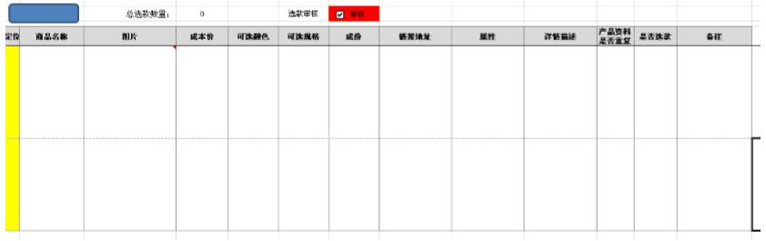
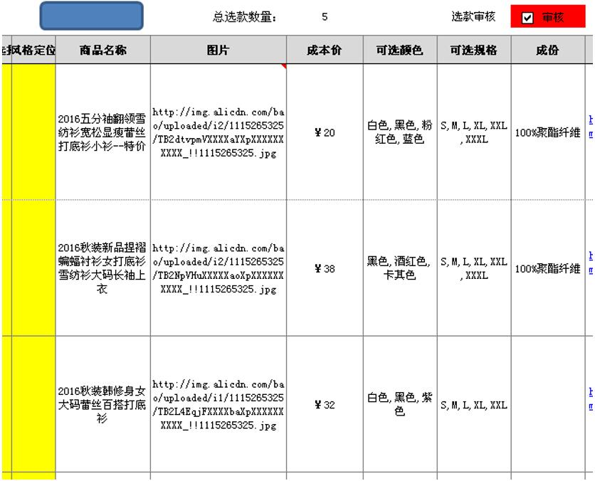

# 5.12 VBA+勤哲实现批量添加网络图片(对接阿里巴巴)
需求：通过自动读取相对应列的图片网址，自动添加到图片列，从而完成添加图片  

案例：需要将备注列的图片网址添加到图片列的内容 

空白模板

 
 
原始数据： 

 

执行后效果：自动直接把图片内的图片链接转换成图片

  

### 关键代码 
	
```vb
'引入API
Private Declare Function URLDownloadToFile Lib "urlmon" Alias "URLDownloadToFileA" (ByVal pCaller As Long, ByVal szURL As String, ByVal szFileName As String, ByVal dwReserved As Long, ByVal lpfnCB As Long) As Long 
'Public Declare Function DeleteUrlCacheEntry Lib "wininet" Alias "DeleteUrlCacheEntryA" (ByVal lpszUrlName As String) As Long 
'下载函数
Function getImg(url As String, Optional fn As String = "") As String     
	Dim localFilename As String, lngRetVal As Long     
	If fn = "" Then fn = Rnd(1) * 99999999 & ".jpg"     
	localFilename = ThisWorkbook.Path & Application.PathSeparator & fn     
	lngRetVal = URLDownloadToFile(0, url, localFilename, 0, 0) 
	'    Debug.Print lngRetVal     
	If lngRetVal = 0 Then 
	'        DeleteUrlCacheEntry url    '清除缓存         
	getImg = localFilename     
	Else         
	getImg = ""     
	End If 
End Function 
'按钮宏
Sub getImg2() 
    Dim cel     
	With Application.COMAddIns("esclient10.connect").Object         
		For Each cel In Range("_picLink")             
			If cel.Value <> "" Then                 
				Cells(cel.Row, 13).Select                 
				.AddPicture getImg(cel.Value), 1, cel.Row, 13        '插入图片到sheet1,链接行,第13列     
			End If         
		Next     
	End With 
End Sub 
```

### 其他说明
addpicture 的用法是 addpicture 图片路径,sheet,row,col 图片路径用 getImg（url）去下载 
  
如果要是单一的图片的话， 直接 addpicture 不用 for 循环 

### VBA-Demo 
[模板下载](c5/12/5.12.xls ':ignore')

*** 此功能在慧表NX中可直接利用API提数完成 ***

### 本节贡献者
*@张波*
