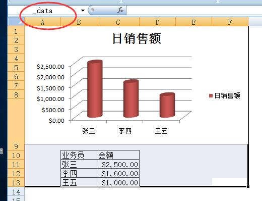
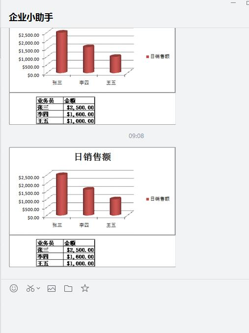

# 截图本模板发微信提醒
需求：设置一个定时自动任务，表单或报表保存时将内容截图并通过微信发给相关人。

## 实现步骤
首先，在模板上设置要截图的区域，这里我设置的是A1:F13，定义名称为`_data`



然后，ALT+F11打开vbe，在thisworkbook中加入以下代码

```vb
Private Sub Workbook_BeforeSave(ByVal SaveAsUI As Boolean, Cancel As Boolean)
    Call RangeToPic(Range("_data"))
End Sub
```

插入一个模块，加入下列代码
```vb
Sub RangeToPic(Rng As Range, Optional Pnm = "", Optional Pth = "")
    If Pth = "" Then Pth = "c:\3256"
    If Pnm = "" Then Pnm = "22"  '默认图片路径

    Rng.CopyPicture Appearance:=xlScreen, Format:=xlPicture  '截图
    
    With ActiveSheet.ChartObjects.Add(0, 0, Rng.Width + 1, Rng.Height + 1).Chart
        .Paste
        .Export Pth & "" & Pnm & ".gif", "gif" '保存图片
        .Parent.Delete
    End With
   
    Range("a18").Select '选择A18,这一步必须
    Application.COMAddIns("ESClient10.Connect").Object.AddPicture "c:\325622.gif", 1, 18, 1 '插入图片到A18    
End Sub
```

最后，设置好新建提醒表单公式，大功告成。


## 实际效果
新建表单保存，A18自动插入了截图。


企业微信收到提醒。



By @dgxiong-vv

2018-7-17 