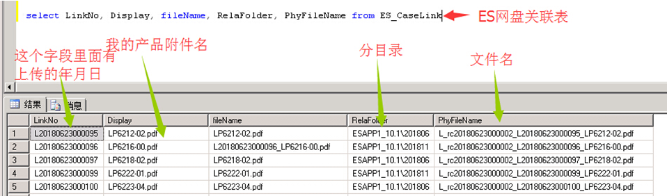

# 自制ES文件动态外链下载
用ES数据库中ES_CaseLink表组合字段生成动态外部下载链接视图

## 目的
1. 生成下载ES网盘上传的附件链接(可以用于IIS搭建下载站点、也可以邮件自动外发链接给客户)
2. 上传的同产品附件保证下载为最新版本

ES_CaseLink表主要字段（有些字段我没用上就没有列出来）



下面是我做的视图

```sql
CREATE VIEW ggsjiang as
select 时间,型号,(select 'http://我的网站地址/'+主目录+'/'+副目录+'/'+ PhyfileName) as 地址 from
(select b1.时间, b1.型号,left(relafolder,charindex('\',relafolder)-1) as 主目录,substring(relafolder,charindex('\',relafolder)+1,len(relafolder)-charindex(',',relafolder)) as 副目录, PhyfileName from
(select max(时间) as 时间,型号 from
(select CAST(Substring(linkno,2,8) AS int) as 时间,left(filename,charindex('-',filename)-1) as 型号 from ES_CaseLink where filename like'LP%.pdf')as a group by 型号)as b1,
(select left(filename,charindex('-',filename)-1) as 型号,Substring(linkno,2,8) as 时间,
filename, relafolder, PhyfileName from ES_CaseLink where filetype ='.pdf' and filename like 'LP%.pdf') as b2
where b1.时间= b2.时间 and b1.型号= b2.型号)as W
```


之后我用IIS搭建了ES网盘为主目录的网站，再用活字格建立了产品查询下载站点。

By @㊣人㊣

2019