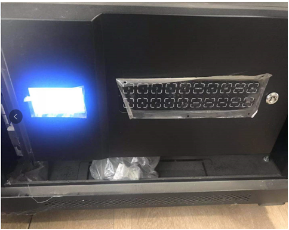
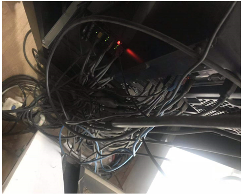
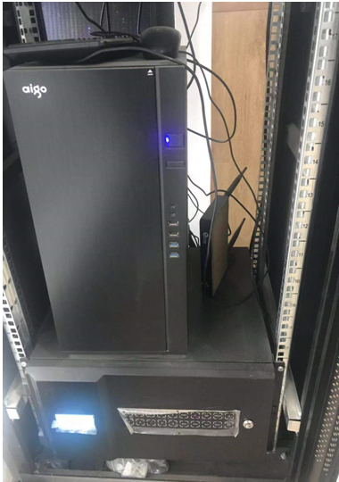
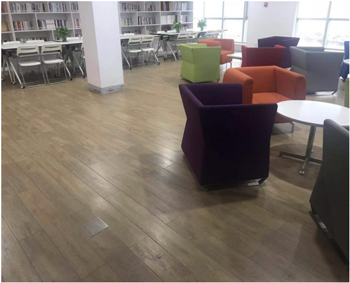
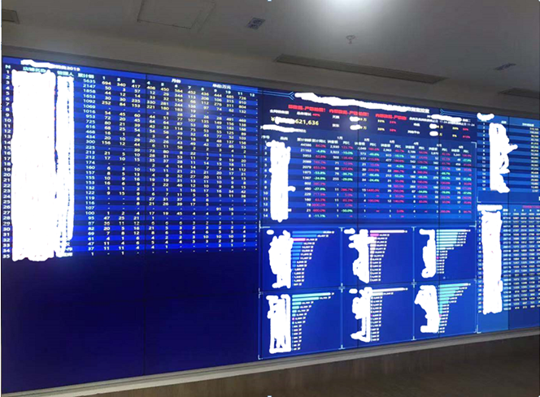

# 大屏开发使用简历
感谢@小岛大佬的投稿，撒花~

## 装机

对于大屏的使用已经不是什么高科技，这里展示下我们大屏配方和应用的最最最日常的场景。

不多废话直接上图，下面号称是N路分频神器

这个家伙的背后插满了视频线，连接到大屏。

大屏i7主机，自己diy的一套视频服务器电脑，平时啥也不干专门服务大屏。

主机边上的长有两个小辫子的是音频输出，类似蓝牙。功放和麦克风集成。

## 场景

我们小会场的小环境，平时是这样的，有一丝丝小资情调，平日没事也不敢坐的，开会时摆满了防止瞌睡的椅子。

本文的主角大屏，日常的数据展示，开会时展示PPT，播放视频。

重点说下这个数据展示，每个版块可以自动翻页展示不同维度的数据，全部是数字标题，密密麻麻，老板喜欢这样。

这个大屏是用FR开发(帆软的一款二次开发平台)，本人一直玩ES，用了这个fr感觉手握倚天剑和屠龙刀，霸占了整个武林。

本文不是FR的托，真实写照，有感而发。

感谢一零村长的大力支持和鼓励，感谢群友孜孜不倦的教导，就让我的大屏再飞两年吧！

By @小岛

2019-12-4