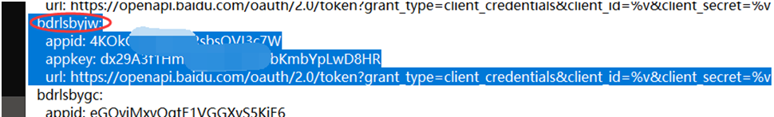
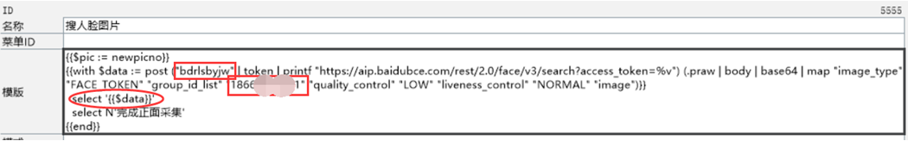

# 拥抱AI，玩转ESAP实现人脸识别

## 第一步

在百度AI上人脸识别里面创建应用 https://console.bce.baidu.com/ai/?fromai=1#/ai/face/overview/index

请记住以下（用于配置ESAP的token）：API Key和Secret Key
 


## 第二步

在百度AI上建立人脸库（建立好后进行采集几张） https://ai.baidu.com/facekit/home

请记住以下（用于写ESAP_查询语句）：人脸组ID
 


## 第三步

配置tokenserver
 


## 第四步

写ESAP_查询语句，具体参考身份证

```sql
{{with $data := post ("bdface" | token | printf "https://aip.baidubce.com/rest/2.0/face/v3/search?access_token=%v") (.praw | body | base64 | map "image_type" "BASE64" "group_id_list" "mm520" "quality_control" "LOW" "liveness_control" "NORMAL" "image")}}
  select '{{if .result}}{{(index .result.user_list 0).user_id}}{{else}}没找到{{end}}，请续传或输入“退出”'
{{end}}
```



* 第一个红框表示ESAP里面的应用名

* 第二个红框是人脸库里面人脸组的ID

* 第三个红框表示的是显示返回的结果
 
## 本节贡献者

@昆明-伤疤也微笑

2019-7-19

