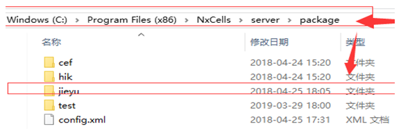
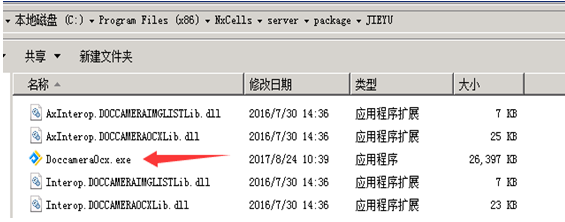
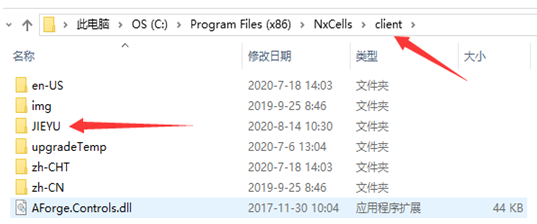
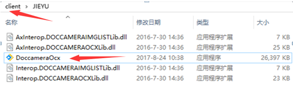
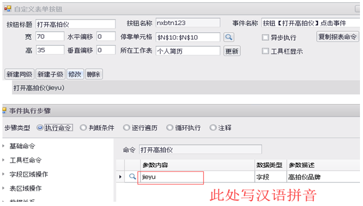
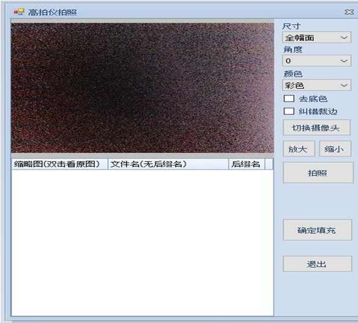

# 6.13 NX捷宇高拍仪对接步骤

> 整理：长亭红日
> 日期：2020年8月14日

## 一、	连接捷宇高拍仪L10，无需安装驱动。

## 二、	到NX群下载插件包JIEYU

1、	到NX服务器端电脑，将插件包解压放到server目录下的package内。

2、	打开捷宇插件文件夹，安装DoccameraOcx.EXE

3、	到客户端电脑，将插件包解压放到client目录下的package内。

4、	打开捷宇插件文件夹，安装DoccameraOcx.EXE

## 三、	NX模板调用高拍仪

1、	在模板新建报表命令，参数填入 jieyu

2、	点击按钮，调用高拍仪弹窗，点击【拍照】。

3、选择填充字段，选中弹窗下方要填充的图片，点击【确认填充】。

## 本节贡献者

@长亭红日
