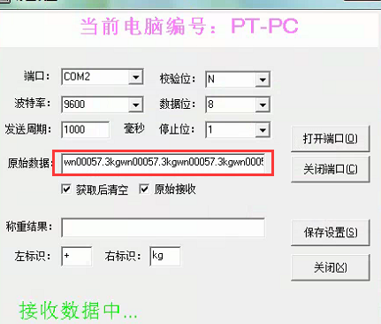
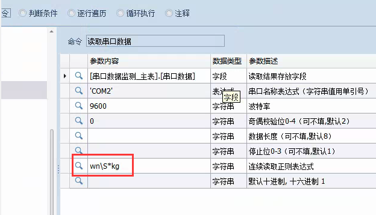
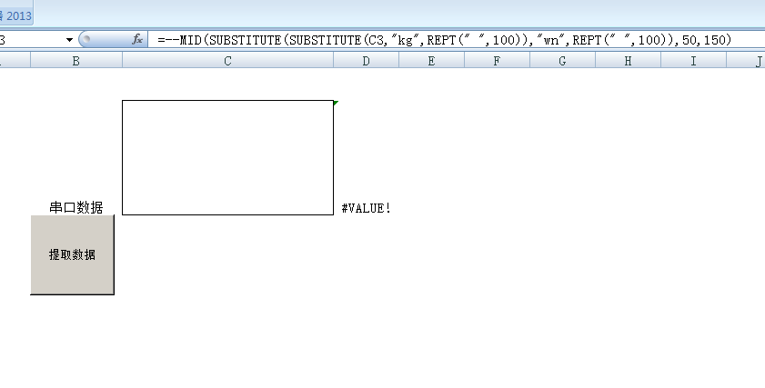
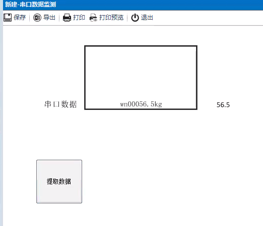
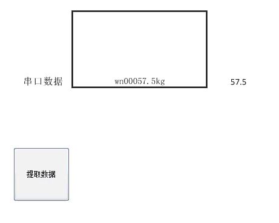
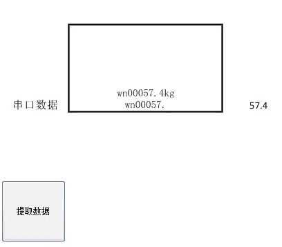

# 6.13 NX电子秤对接步骤

> 案例提供：@Monster

> 日期：2020年11月23日

## 一、	电子秤连接到客户端计算机，略。

## 二、	分析电子秤协议

1、	打开串口调试，可以看到原始数据。

2、	通过分析，发现这个秤会持续向串口发送`wn00057.3kg`字符，也就是说是个简单串口协议：

* 协议头是`wn`
* 协议尾是`kg`
* 头尾之间的字符就是数据

## 三、	NX串口读取命令设置

跟据协议，我们设置如图：

其中正则部分，用`wn\S*kg`截取完整数据段

## 四、	字符转数字

提取`wn00057.3kg`字符中的数字，可直接用EXCEL，如图：

## 五、	最终效果

多次点击提取数据：

## 本节贡献者

@Monster
